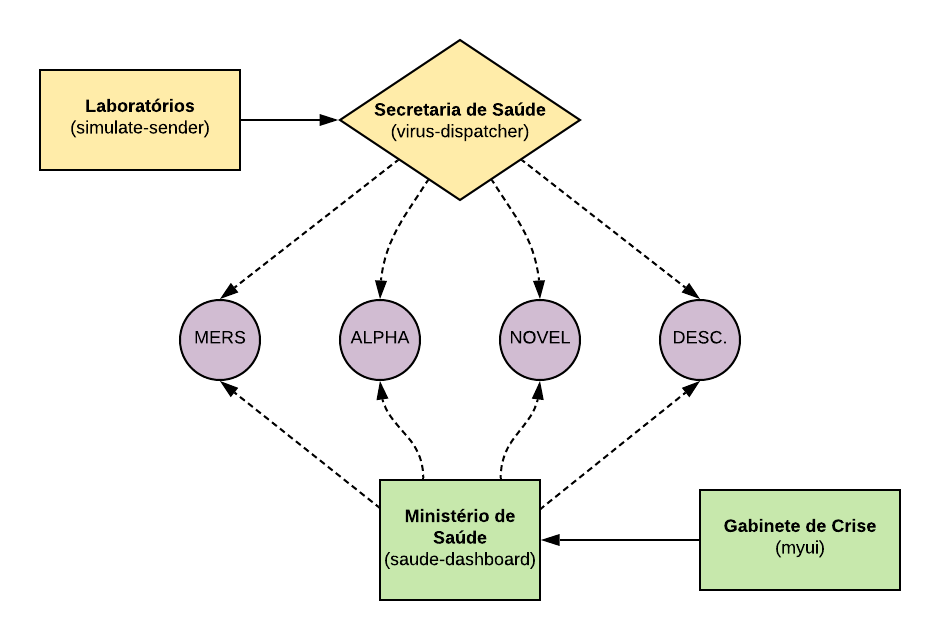

# demo-summitgov-cy20



## Estrutura de Diretórios

```
--_infra
  |--application (Objetos K8S)  
    |--demo-saude-digital
      |--camel-k-channels.yaml
      |--camel-k-integration-plataforms.yaml
      |--camel-k-integrations.yaml
      |--deployments.yaml
      |--kustomization.yaml
      |--nasmespaces.yaml
      |--openshift-routes.yaml
      |--services.yaml
    |--demo-saude-digital-streams
      |--kafka-clusters.yaml
      |--kafka-topics.yaml
      |--kustomization.yaml
      |--namespaces.yaml
  |--multicluster (Objetos ACM)
    |--demo-saude-digital
      |--demo-saude-digital.yaml
    |--demo-saude-digital-streams
      |--demo-saude-digital-streams.yaml
-- components
  |--routes
    |--VirusDispatcher	(Despachar o resultado do laboratório para os manipuladores pelo Channel)
	  |--channel (Canal Knative para receber eventos)
		  |--Alpha
		  |--Mers
		  |--Unknown
		  |--Noval (COVID-19)
	  |--handlers (Manipuladores que enviam aviso ao Painel por eventos do canal)
		  |--Alpha
		  |--Mers
		  |--Unknown
		  |--Noval (COVID-19)
	  |--Simulator
		  |--SimulatorSend (Enviar dados de laboratório falsos)
		  |--Dashboard (Enviar notificação para o Painel)
		  |--SimulatorCloudEvent (RC 1- Problema com dois Camel K operadores)
  |--ui
  |--dashboard
    
```

## Pré-requisitos

O ambiente deve ter os seguintes operators habilitados e devidamente configurados:

1. Knative Serving + Eventing (OpenShift Serverless)
1. Strimzi (AMQ Streams)
1. Camel-K


## Instalação

Você pode implantar essa demonstração de forma automatizada ou manual.

### Automatizado

```
$ git clone https://github.com/redhat-sa-brazil/demo-summitgov-cy20.git
$ cd demo-summitgov-cy20
$ kubectl apply -k _infra/application/demo-saude-digital-streams
$ kubectl apply -k _infra/application/demo-saude-digital

```

### Manual

#### Instalar dependências

1. Criar projeto para configurar fluxos AMQ (Kafka)

```
oc new-project streams

```

2. Crie o cluster do Kafka Cluster no projeto de fluxos

```
apiVersion: kafka.strimzi.io/v1beta1
kind: Kafka
metadata:
  creationTimestamp: '2020-05-18T10:56:50Z'
  generation: 1
  name: my-cluster
  namespace: demo-saude-digital-streams
  resourceVersion: '1068779'
  selfLink: >-
    /apis/kafka.strimzi.io/v1beta1/namespaces/demo-saude-digital-streams/kafkas/my-cluster
  uid: 52a0bb1c-ab61-4c64-afce-5a45642b2d83
spec:
  entityOperator:
    topicOperator: {}
    userOperator: {}
  kafka:
    config:
      log.message.format.version: '2.4'
      offsets.topic.replication.factor: 3
      transaction.state.log.min.isr: 2
      transaction.state.log.replication.factor: 3
    listeners:
      plain: {}
      tls: {}
    replicas: 3
    storage:
      type: ephemeral
    version: 2.4.0
  zookeeper:
    replicas: 3
    storage:
      type: ephemeral
status:
  conditions:
    - lastTransitionTime: '2020-05-18T10:56:51+0000'
      message: Kafka cluster is being deployed
      reason: Creating
      status: 'True'
      type: NotReady
  observedGeneration: 0
```

3. E também crie o Tópico Kafka

```
apiVersion: kafka.strimzi.io/v1beta1
kind: KafkaTopic
metadata:
  name: my-topic
  labels:
    strimzi.io/cluster: my-cluster
  namespace: demo-saude-digital-streams
spec:
  partitions: 10
  replicas: 3
  config:
    retention.ms: 604800000
    segment.bytes: 1073741824
```

4. Criar espaço para nome para a demonstração

```
oc new-project demo-saude-digital

```

5. Create Camel K Integration Platform

```
apiVersion: camel.apache.org/v1
kind: IntegrationPlatform
metadata:
  name: example
  namespace: demo-saude-digital
spec: {}
```


#### Instalar aplicativos

Painel de configuração

```
oc new-app quay.io/gedasilv/myui
oc expose service myui
```

Obtenha a localização do seu dashboard

```
oc get route
```


#### Configuração do aplicativo

##### Manipulador de surto de vírus existente

- Canal de instalação, em src/channel

```
oc create -f channelalpha.yaml		
oc create -f channelmers.yaml
oc create -f channelunknown.yaml
oc create -f channelnoval.yaml		
```

- Instale o manipulador de surtos de vírus existente, em src/handlers

```
kamel run -d camel-jackson AlphaHandler.java
kamel run -d camel-jackson MersHandler.yaml
kamel run -d camel-jackson UnknownHandler.groovy
```


- Comece a enviar o resultado do laboratório, em src/simulator

```
kamel run -d camel-jackson -d camel-bean SimulateSender.java 
kamel run Dashboard.java
```

- Comece a despachar o resultado do vírus para os manipuladores, em src/

```
kamel run -d camel-jackson VirusDispatcher.java --dev
```

- Acesse o Painel para ver o vírus


##### Adicionando manipulador COVID-19

- Instale o novo manipulador de surtos COVID19, em src/handlers

```
kamel run -d camel-jackson NovalHandler.java
```

- Atualize seu VirusDispatcher.java em src / adicione a seguinte condição ***(Você deveria estar usando o modo DEV)***

```
	      .when().simple("${body.genuses} == 'Novalvirus'")
             .marshal(jacksonDataFormat)
             .log("MERS - ${body}")
             .to("knative:channel/noval-handler")
```
