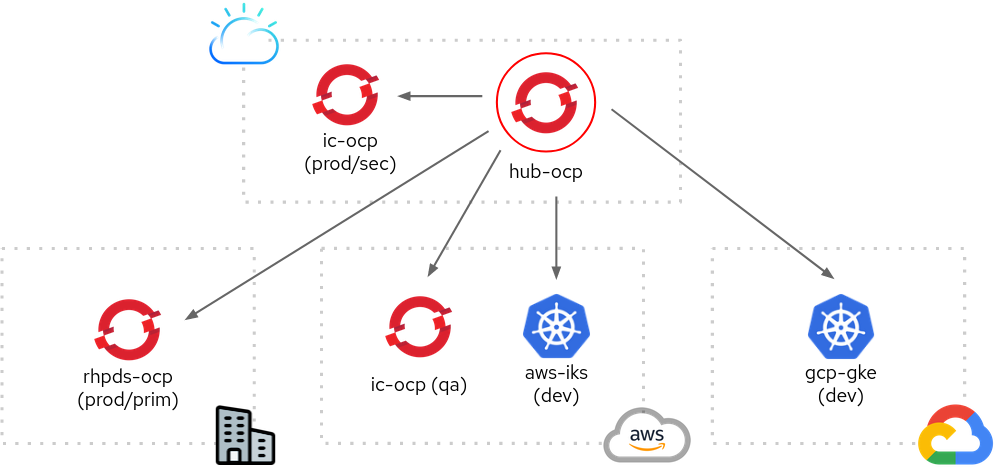

# Recursos do Red Hat Advanced Cluster Management (ACM)

## Estrutura de Diretórios

```
├── appmgmt (gestão de ciclo de vida de apps)
│   ├── demo-etherpad.yaml
│   ├── demo-saude-digital-streams.yaml
│   └── demo-saude-digital.yaml
├── policy (gestão de políticas)
    ├── demo-iampolicy.yaml
    ├── demo-k8s-certs.yaml
    └── demo-namespace.yaml
   
```

## Informações Gerais



O ambiente de laboratório deve ser provisonado respeitando a topologia e seus respectivos `labels` para que os recursos ACM sejam válidos. Mais informações sobre estes objetos, recomenda-se a leitura da [documentação oficial](https://github.com/open-cluster-management/rhacm-docs).